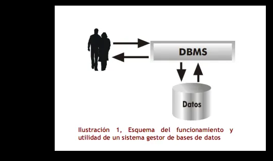
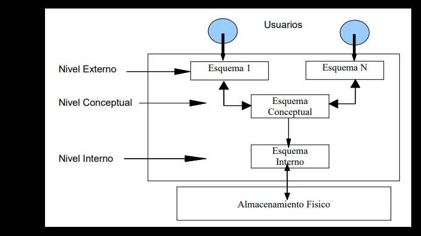
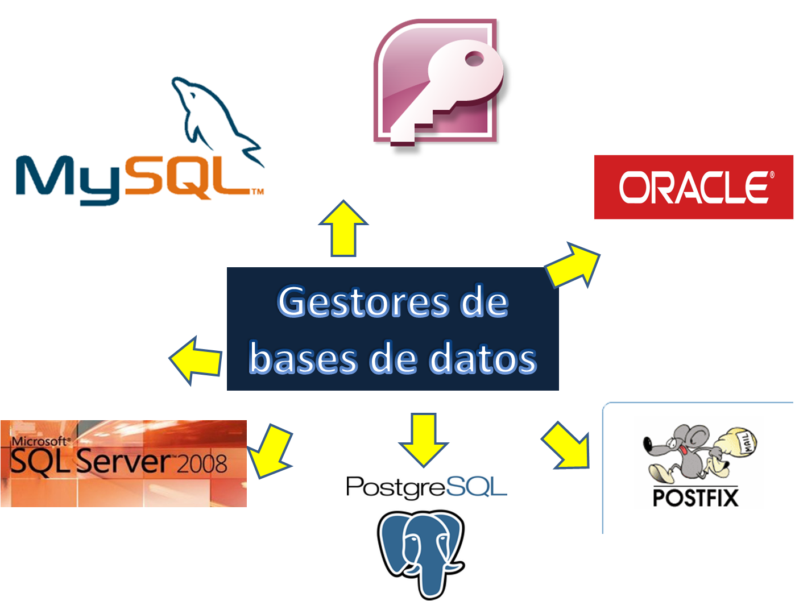

import { Card, CardGrid, Tabs, TabItem, Icon, FileTree, Steps } from '@astrojs/starlight/components';

<CardGrid stagger>
  <Card title="DBMS Fundamentals" icon="document">
    Learn about Database Management Systems, their components, and architecture.
  </Card>
  <Card title="Types & Components" icon="setting">
    Explore different types of DBMS and their essential components.
  </Card>
  <Card title="Architecture" icon="puzzle">
    Understanding the three-level architecture and data independence.
  </Card>
  <Card title="Users & Tools" icon="user">
    Different types of database users and available management tools.
  </Card>
</CardGrid>

## Introduction

A Database Management System (DBMS) is a software package designed to store, manage, and facilitate access to databases. When data in an information system is stored in a single structure, it's called a database.

## Components of a Database System

<Tabs>
  <TabItem label="Hardware">
    - Machines where databases are stored
    - Include mass storage units for this purpose
  </TabItem>
  <TabItem label="Software">
    - The database management system
    - Application that enables database handling
  </TabItem>
  <TabItem label="Data">
    - Includes stored data
    - Metadata (data describing what's stored)
  </TabItem>
  <TabItem label="Users">
    - End users: Use applications that work with database data
    - Developers: Create programs that provide database views
    - Administrators (DBAs): Manage maintenance, security, and performance of the database
  </TabItem>
</Tabs>
 
:::caution[Important]
Database administrators (DBAs) play a crucial role in:
- Database creation and maintenance
- Security management
- Disaster recovery
- Performance optimization
- Query control and statistics
:::

## DBMS Objectives

The main objectives of a DBMS include:

- Providing tools for data creation and specification
- Managing physical structure in storage units
- Offering data manipulation tools
- Ensuring disaster recovery capabilities
- Enabling backup creation
- Managing database communications
- Supporting external data schema applications
- Facilitating database installation
- Enabling data import/export

## Advantages of DBMS

:::note[Key Benefits]
1. Data Independence
2. Data Coherence
3. Data Availability
4. Improved Information Usage
5. Enhanced Data Processing Efficiency
6. Reduced Storage Space
7. Data Security and Integrity
:::

:::tip[Efficiency Boost]
DBMS significantly improves data management efficiency compared to traditional file systems.
:::

## Architecture Levels

The ANSI/SPARC architecture defines three levels:

<Steps>
1. **External Level**
   - User views of the database
   - Partial or transformed data views

2. **Conceptual Level**
   - Global database vision
   - Defines records, associations, and constraints

3. **Internal Level**
   - Corresponds to files, indexes
   - Data defined at operating system level
</Steps>

## Types of DBMS

<CardGrid>
  <Card title="Commercial" icon="seti:lock">
    Paid and Private
    
    **Examples:**
    - PostgreSQL
    - MySQL
    - MariaDB
    - SQLite
    - Apache Derby
  </Card>
  <Card title="Free" icon="star">
    Free and Open-Source
    
    **Examples:**
    - Oracle
    - Microsoft SQL Server
    - IBM DB2
    - Sybase ASE
    - Microsoft Access
  </Card>
</CardGrid>
 

 

:::note[Contributing]
This documentation is community-maintained. If you find errors or want to contribute, please visit our [GitHub repository](https://github.com/Meursault0110/ZaoHub-Docs).
:::