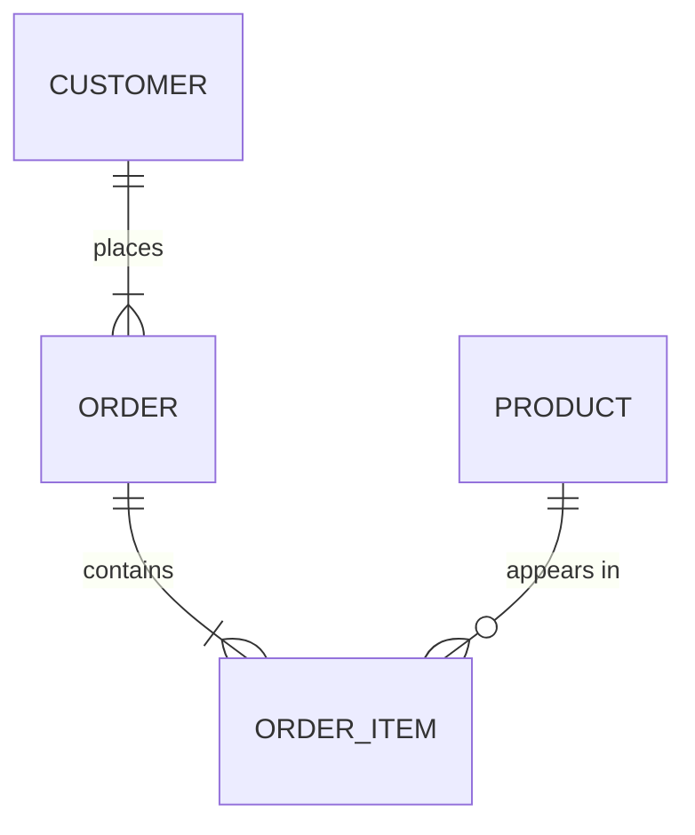
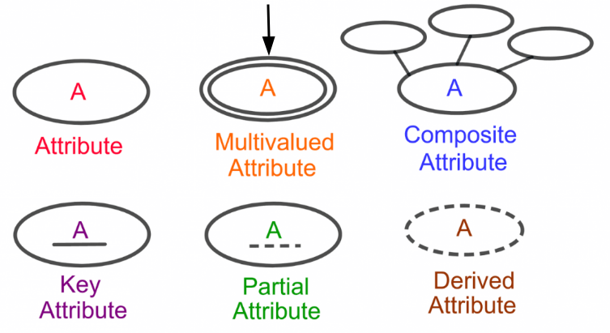
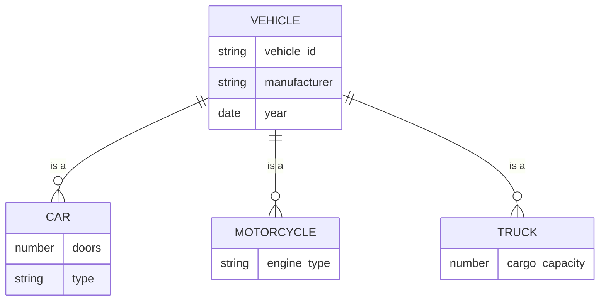
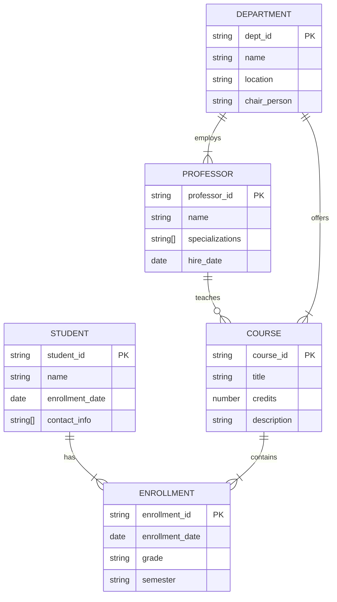

import { Card, CardGrid, Tabs, TabItem, Icon, Steps, LinkCard } from '@astrojs/starlight/components';

## Introduction to Data Models

A data model is an abstraction mechanism that enables the construction of a conceptual data representation for users. It describes not only the data structure at a conceptual level but also includes a set of basic operations on the structured data.

Database Management Systems (DBMS) are designed based on specific data models, which can be classified as:
- Relational
- Hierarchical
- Network
- Object-oriented
- Logical
<br/>
<CardGrid>
  <Card title="Conceptual Design" icon="document">
    Focus on high-level data structure representation
  </Card>
  <Card title="Implementation" icon="setting">
    Independent of specific database systems
  </Card>
</CardGrid>

## Entity-Relationship (E-R) Model

<Card title="What is the Entity-Relationship Model?" icon="information">
  The Entity-Relationship (E-R) Model, introduced by Peter Chen in 1976, is a cornerstone of database design that provides a conceptual framework for describing data in terms of entities, their attributes, and relationships between entities.
</Card>

### Key Features

<CardGrid stagger>
  <Card title="Data Focus" icon="document">
    Emphasizes data structure and relationships without implementation details
  </Card>
  <Card title="Visual Representation" icon="seti:code-search">
    Provides clear graphical notation for complex data relationships
  </Card>
  <Card title="System Independence" icon="setting">
    Works independently of specific database management systems
  </Card>
  <Card title="Scalability" icon="random">
    Easily adaptable to evolving system requirements
  </Card>
</CardGrid>

## Core Components

### 1. Entities

Entities are the foundation of the ER model, representing distinct objects or concepts in the system.

<Tabs>
  <TabItem label="Strong Entities">
    ```mermaid
    erDiagram
        EMPLOYEE {
            string employee_id PK
            string name
            date hire_date
        }
    ```
    - Self-sufficient entities
    - Have their own primary key
    - Represented by single rectangle

    
  </TabItem>
  <TabItem label="Weak Entities">
    ```mermaid
    erDiagram
        EMPLOYEE ||--o{ DEPENDENT : has
        DEPENDENT {
            string dependent_name PK
            string relationship
            date birth_date
        }
    ```
    - Depend on strong entities
    - Identified through parent entity
    - Represented by double rectangle

    
  </TabItem>
</Tabs>

### 2. Relationships

Relationships define how entities interact with each other.

#### Types of Relationships



<Tabs>
  <TabItem label="Binary Relationships">
    <CardGrid stagger>
      <Card title="One-to-One (1:1)">
        - Each entity relates to exactly one other entity
        - Example: Person ↔ Passport
      </Card>
      <Card title="Many-to-Many (N:M)">
        - Multiple entities relate to multiple entities
        - Example: Students ↔ Courses
      </Card>
      <Card title="One-to-Many (1:N)">
        - One entity relates to multiple entities
        - Example: Department → Employees
      </Card>
    </CardGrid>
  </TabItem>
  <TabItem label="Complex Relationships">
    <CardGrid>
      <Card title="Recursive Relationships">
        - Entity relates to itself
        - Example: Employee → Manager
      </Card>
      <Card title="Ternary Relationships">
        - Involves three entities
        - Example: Supplier-Part-Project
      </Card>
    </CardGrid>
  </TabItem>
</Tabs>

### 3. Attributes

<Steps>
1. **Simple Attributes**
   ```mermaid
   erDiagram
       PERSON {
           string name
           number age
           string email
       }
   ```

2. **Composite Attributes**
   ```mermaid
   erDiagram
       PERSON {
           string first_name
           string last_name
           address address
       }
       ADDRESS {
           string street
           string city
           string postal_code
       }
   ```

3. **Multivalued Attributes**
   ```mermaid
   erDiagram
       PERSON {
           string name
           string[] phone_numbers
           string[] email_addresses
       }
   ```

4. **Derived Attributes**
   ```mermaid
   erDiagram
       EMPLOYEE {
           date birth_date
           number age
           number years_service
       }
   ```
</Steps>


## Advanced Concepts

### Specialization and Generalization



<Tabs>
  <TabItem label="Total Specialization">
    Every supertype entity must belong to at least one subtype
    :::note
    Represented with a circle (○) on the specialization line
    :::
  </TabItem>
  <TabItem label="Partial Specialization">
    Supertype entities may not belong to any subtype
    :::note
    Default representation without special notation
    :::
  </TabItem>
</Tabs>

### Constraints

<CardGrid>
  <Card title="Cardinality Constraints" icon="setting">
    - Minimum and maximum number of relationship instances
    - Notation: (min, max)
  </Card>
  <Card title="Participation Constraints" icon="approve-check">
    - Total: Every entity must participate
    - Partial: Participation is optional
  </Card>
</CardGrid>

## Best Practices

### Design Guidelines

<Steps>
1. **Entity Identification**
   - Choose meaningful entity names
   - Identify all relevant attributes
   - Define clear primary keys

2. **Relationship Modeling**
   - Determine correct cardinalities
   - Consider relationship attributes
   - Evaluate relationship participation

3. **Attribute Organization**
   - Group related attributes
   - Identify derived attributes
   - Handle multivalued attributes appropriately

4. **Constraint Definition**
   - Apply business rules
   - Define integrity constraints
   - Document all constraints
</Steps>

### Common Pitfalls to Avoid

:::danger[Common Mistakes]
- Creating unnecessary relationships
- Confusing attributes with entities
- Incorrect cardinality specification
- Overlooking weak entities
- Improper primary key selection
:::

## Practical Examples

### University Database



:::note[Contribution]
This documentation is continuously updated. If you find any errors or want to contribute, please visit our [GitHub repository](https://github.com/Meursault0110/ZaoHub-Docs).
:::