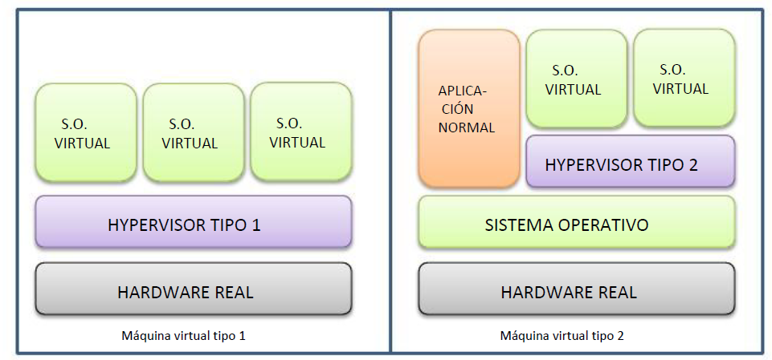

import { Card, CardGrid, Tabs, TabItem, Icon } from '@astrojs/starlight/components';

## Definition of Virtualization

:::note[Historical Origin]
The concept of virtual machine was invented by IBM as a time-sharing method for mainframes (VM/370).
:::

Virtualization is a set of techniques that allow creating one or more "virtual" computers within a real computer. A virtual machine (VM) can be defined as a software implementation of a physical machine, that is, a "software" computer that behaves practically the same as a real computer.

<CardGrid>
  <Card title="Host OS" icon="laptop">
    It is the OS of the real machine. The host runs the virtualization application that allows creating VMs.
  </Card>
  <Card title="Guest OS" icon="document">
    It is the OS of the virtual machine. This guest can run virtualization add-ons to improve integration with the host.
  </Card>
  <Card title="Hypervisor" icon="setting">
    It is the platform that allows applying virtualization techniques and using different VMs on the same real machine.
  </Card>
</CardGrid>

### Most Known Hypervisors

- VMware
- VirtualBox
- Hyper-V
- Parallels (for smaller OS)
- QEMU

## Utility of Virtualization

<Tabs>
  <TabItem label="Normal Users">
    - Allows testing SW without installing it on the real machine
    - Allows testing new OS without formatting the real machine
    - Protection against malware during testing
    - Run programs not compatible with modern OS
    - "Duplicable", "freezable" and recoverable system
    - Ideal for educational environments
  </TabItem>
  <TabItem label="Developers">
    - Compatibility testing on different OS
    - Testing on virtual mobile devices
    - Simulation of complete network infrastructures
    - Web rendering tests on different OS
  </TabItem>
  <TabItem label="Servers">
    - Creation of multiple services on the same server
    - Isolation of execution environments
    - Maximum hardware utilization
  </TabItem>
</Tabs>

## Practical Aspects

:::tip[Important]
Each guest OS believes it is the only OS on the computer, but resources are controlled and distributed by the hypervisor.
:::

### Hardware Considerations

- Memory is usually the most limiting resource
- Virtualization is supported by hardware in modern processors
  - Intel: VT-x
  - AMD: AMD-V
- BIOS/UEFI configuration required to enable these features

## Types of Hypervisors

<CardGrid>
  <Card title="Type 1 (Native)" icon="rocket">
    Runs directly on hardware
    
    **Advantages:**
    - Better performance
    
    **Examples:**
    - VMware ESXi
    - Citrix XenServer
    - Hyper-V
  </Card>
  <Card title="Type 2 (Hosted)" icon="laptop">
    Runs on the host OS
    
    **Advantages:**
    - Greater flexibility
    - Support for different architectures
    
    **Examples:**
    - VMware Player
    - VirtualBox
    - QEMU
  </Card>
</CardGrid>
 

## Paravirtualization

Paravirtualization is a technique that seeks to increase performance by modifying the OS kernel to be aware that it is being virtualized.

:::note[Operation]
In paravirtualization:
- The guest OS is aware of its virtualization
- Direct communication with the hypervisor
- Use of hypercalls for better performance
:::

### Advantages
- Better performance than full virtualization
- Lighter hypervisor
- More efficient communication between systems

:::caution[Limitation]
Requires modification of the guest OS kernel to work correctly.
:::