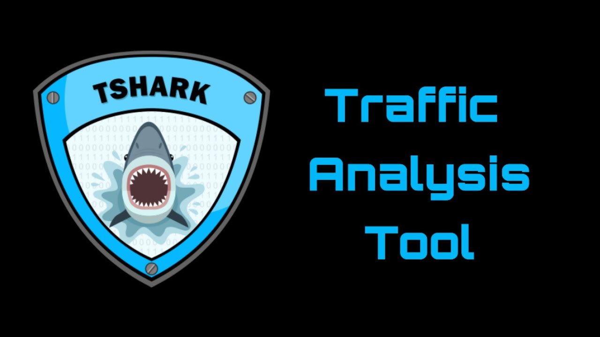

import { Steps, Tabs, TabItem } from '@astrojs/starlight/components';



## About Tshark

TShark is a network protocol analyzer. It lets you capture packet data from a live network, or read packets from a previously saved capture file, either printing a decoded form of those packets to the standard output or writing the packets to a file.

## Table of Contents

- [Basic Capture Commands](#basic-capture-commands)
- [Display Filters](#display-filters)
- [Capture Filters](#capture-filters)
- [Output Options](#output-options)
- [Interface Options](#interface-options)
- [Advanced Analysis](#advanced-analysis)
- [Statistics](#statistics)

## Basic Capture Commands

<Steps>
1. **Starting a Capture**
   ```bash
   tshark                     # Basic capture on default interface
   tshark -i eth0            # Capture on specific interface
   tshark -c 100             # Capture only 100 packets
   tshark -a duration:30     # Capture for 30 seconds
   ```

2. **Basic Filtering**
   ```bash
   tshark -f "port 80"       # Capture HTTP traffic
   tshark -f "host 192.168.1.1"  # Capture traffic from/to specific host
   tshark -Y "http"          # Display only HTTP packets
   ```

3. **File Operations**
   ```bash
   tshark -w capture.pcap    # Write capture to file
   tshark -r capture.pcap    # Read from capture file
   tshark -R "http" -r file.pcap  # Read with display filter
   ```
</Steps>

## Display Filters

<Tabs>
  <TabItem label="Protocol Filters">
    ```bash
    tshark -Y "tcp"          # Show only TCP traffic
    tshark -Y "udp"          # Show only UDP traffic
    tshark -Y "dns"          # Show only DNS traffic
    tshark -Y "http"         # Show only HTTP traffic
    tshark -Y "ssl"          # Show only SSL/TLS traffic
    ```
  </TabItem>

  <TabItem label="Advanced Filters">
    ```bash
    tshark -Y "ip.addr == 192.168.1.1"  # Traffic from/to specific IP
    tshark -Y "tcp.port == 443"         # HTTPS traffic
    tshark -Y "http.request.method == GET"  # HTTP GET requests
    tshark -Y "frame.len > 1000"        # Large packets
    ```
  </TabItem>
</Tabs>

## Capture Filters

```bash
tshark -f "port not 22"      # Exclude SSH traffic
tshark -f "net 192.168.1.0/24"  # Capture subnet traffic
tshark -f "broadcast"        # Capture broadcast packets
tshark -f "port 53 or port 80"  # Capture DNS or HTTP
```

## Output Options

<Steps>
1. **Format Options**
   ```bash
   tshark -T fields          # Output specific fields
   tshark -T ek              # Elastic Search JSON format
   tshark -T json            # JSON output
   tshark -T pdml            # PDML XML format
   ```

2. **Field Selection**
   ```bash
   tshark -T fields -e frame.time  # Show packet timestamps
   tshark -T fields -e ip.src -e ip.dst  # Show source and destination IPs
   tshark -T fields -e http.host   # Show HTTP hosts
   ```

3. **Statistics Output**
   ```bash
   tshark -z io,stat,1       # IO statistics every second
   tshark -z conv,tcp        # TCP conversation statistics
   tshark -z http,tree       # HTTP statistics
   ```
</Steps>

## Interface Options

<Tabs>
  <TabItem label="Interface Management">
    ```bash
    tshark -D                # List available interfaces
    tshark -i any            # Capture on all interfaces
    tshark -i lo             # Capture on loopback
    tshark -i eth0 -p        # Capture in non-promiscuous mode
    ```
  </TabItem>

  <TabItem label="Interface Settings">
    ```bash
    tshark -i eth0 -s 96     # Snap length of 96 bytes
    tshark -i eth0 -B 64     # Buffer size of 64 MB
    tshark -i eth0 -I        # Monitor mode (if supported)
    ```
  </TabItem>
</Tabs>

## Advanced Analysis

<Steps>
1. **Protocol Analysis**
   ```bash
   tshark -O http            # Detailed HTTP protocol info
   tshark -O dns            # Detailed DNS protocol info
   tshark -V                # Verbose packet details
   ```

2. **Expert Info**
   ```bash
   tshark -G fields         # List all field names
   tshark -G protocols      # List supported protocols
   tshark -G values         # List value strings
   ```

3. **Decryption**
   ```bash
   tshark -o ssl.keys_list:"KEY_FILE"  # Decrypt SSL traffic
   tshark -o http.ssl.port:443         # Set SSL/TLS ports
   ```
</Steps>

## Statistics

```bash
tshark -q -z io,stat,1      # IO statistics
tshark -q -z conv,ip        # IP conversations
tshark -q -z endpoints,ip   # IP endpoints
tshark -q -z expert        # Expert information
tshark -q -z http,tree     # HTTP statistics
```

## Best Practices

- Always specify capture filters to reduce load
- Use display filters for post-capture analysis
- Save captures to files for later analysis
- Monitor buffer statistics to avoid packet drops
- Use appropriate snap lengths for your analysis
- Consider privacy and security implications
- Document your capture configurations

## Common Workflows

<Steps>
1. **Basic Traffic Analysis**
   - Start with broad capture
   - Apply display filters
   - Identify interesting traffic
   - Export relevant packets
   - Generate statistics

2. **Network Troubleshooting**
   - Capture specific host/protocol
   - Monitor error packets
   - Check response times
   - Analyze retransmissions
   - Generate conversation statistics
</Steps>