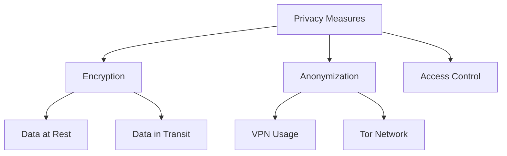

import { Card, CardGrid, Tabs, TabItem, Icon } from '@astrojs/starlight/components';

# Understanding Operational Security

## Overview

Operational Security (OPSec) is a systematic approach to identifying critical information and determining the measures needed to protect assets and operations. This guide introduces fundamental OPSec concepts and best practices for beginners.

:::note[Historical Context]
The term "Operational Security" originated from military operations, where it was crucial to prevent adversaries from gathering intelligence about planned operations. Today, it's equally important in digital security.
:::

## Core Principles of OPSec

### 1. Risk Assessment
- Identify valuable assets and information
- Analyze potential threats and vulnerabilities
- Evaluate risk levels and potential impacts

### 2. Information Classification
- Determine sensitivity levels of different data types
- Establish handling procedures for each classification
- Implement need-to-know principles

### 3. Threat Analysis
<CardGrid stagger>
  <Card title="External Threats">
    - Social engineering attempts
    - Network attacks
    - Physical security breaches
  </Card>
  <Card title="Internal Threats">
    - Data leaks
    - Accidental exposures
    - Insider risks
  </Card>
</CardGrid>

## Best Practices for Beginners

:::tip[Getting Started]
Start with basic security measures and gradually build up your security posture as you learn more about potential threats and countermeasures.
:::

### Essential Security Measures
1. Use strong, unique passwords
2. Enable two-factor authentication (2FA)
3. Maintain updated software and systems
4. Use encrypted communications
5. Practice safe browsing habits

<Tabs>
  <TabItem label="Digital Security">
    - Use VPN services when necessary
    - Implement disk encryption
    - Regular security audits
    - Secure backup strategies
  </TabItem>
  <TabItem label="Physical Security">
    - Secure physical documents
    - Control access to devices
    - Proper disposal of sensitive materials
    - Clean desk policy
  </TabItem>
</Tabs>

## Advanced Topics

### Network Security
- Understanding network protocols
- Firewall configuration
- Intrusion detection systems
- Traffic analysis

### Privacy Enhancement

## Continuing Education

:::caution[Important]
Security is an evolving field. Regular updates to your knowledge and security practices are essential.
:::

### Learning Resources
- Professional certifications
- Online security courses
- Security conferences
- Community forums

## Practical Implementation

<CardGrid>
  <Card title="Daily Practices" icon="pencil">
    Create a routine security checklist for daily operations
  </Card>
  <Card title="Emergency Response" icon="warning">
    Develop incident response plans for security breaches
  </Card>
  <Card title="Regular Updates" icon="refresh">
    Keep security tools and knowledge current
  </Card>
</CardGrid>

## Conclusion

Remember that operational security is an ongoing process, not a one-time implementation. Start with the basics and gradually build your security knowledge and practices over time.

:::tip[Next Steps]
After understanding these fundamentals, proceed to more advanced topics and practical implementations specific to your needs.
:::